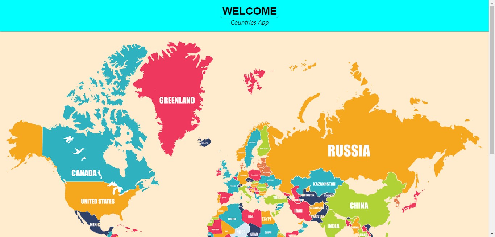
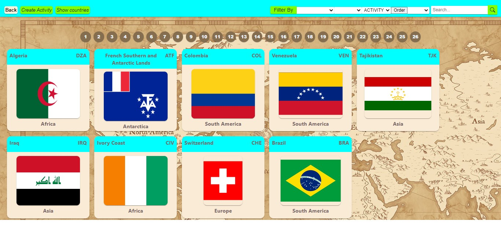
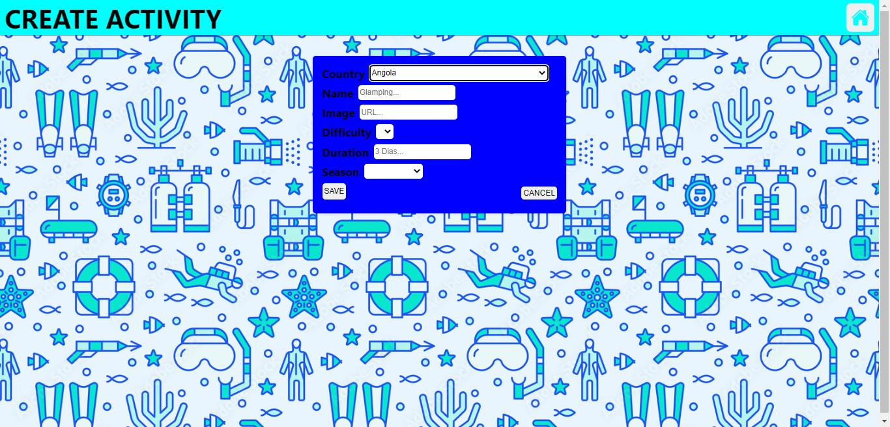
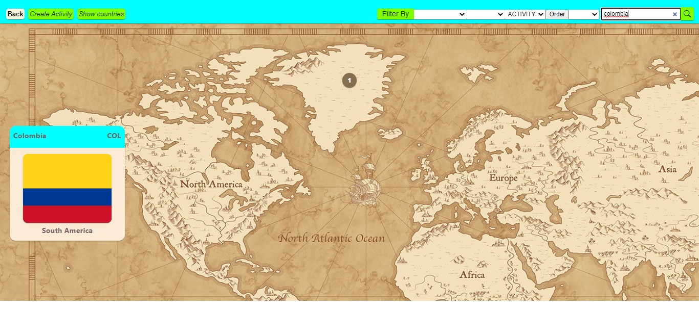
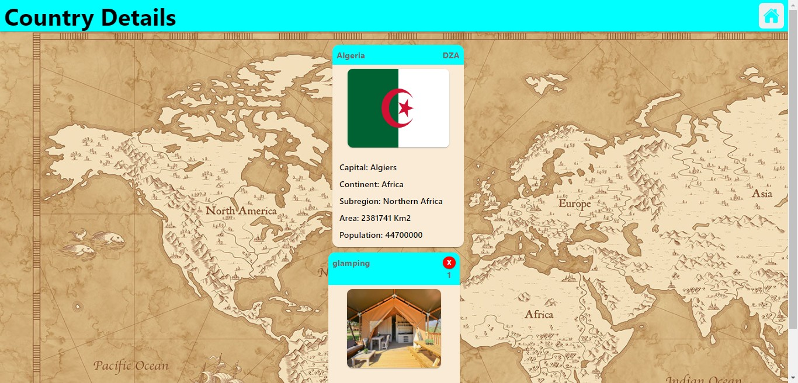

<h1 align="center">Hi 👋, I'm Nelson Andrés Luengas Silva</h1>
<h3 align="center">Desarrollador web Full stack de colombia</h3>

- Actualmente estoy trabajando en un proyecto, SHOP Ecommerce con nuevas tecnologías 

- Además estoy aprendiendo diferentes Lenguajes, Frameworks y herramientas como:
    Typescript, PHP, Java, JavaScript, React, Redux, Angular, Express, Spring Boot, Laravel, Nodejs, SQL, sequelize ORM, MongoDB, entre otros.

- Me encuentro colaborando con algunos proyectos de Ecommerce y autenticación

- Me encuentro revisando para colaborar con pruebas unitarias testing y demás

- Preguntame Sobre React, Angular, Redux, CSS, JavaScript, TypeScript, Sass, NodeJs, SQL, MongoDB.

- Cómo saber sobre mi:
  Correo: Nelsonluengas2@gmail.com
  LinkedIn: <a href='https://www.linkedin.com/in/nelsonluengas/' target="blank">Perfil</a>

- Soy muy curioso, creativo y con mucha iniciativa.

<a href="https://nelson-portafolio.vercel.app/" target="blank"><h3 align="left">Portfolio</h3></a>

# Countries App

  

 

  

 

  

 

  

 

  

